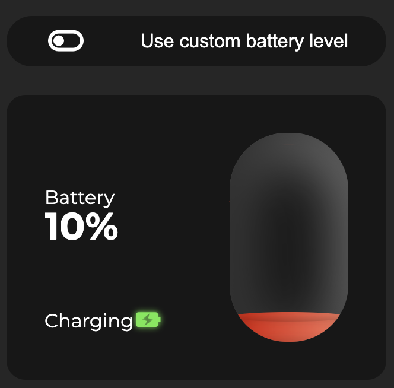

# battery-level-panel

**專案靈感來自於[Bedimcode](https://youtu.be/0gV3kmnLir0)的影片**
主要參照ui顏色設計
剩餘內容使用前端常用框架完成

- [Live Demo](https://connectshark.github.io/battery-level-panel/)

## 專案內容

- vue
- scss
- 使用CSS變數
- grid排版
- 新增額外自訂電量功能

## 功能介紹

- 裝置充電中會顯示充電中提示
- 裝置電量大於99%會顯示滿電提示
- 裝置電量小於20%會顯示電量低提示
- 電池顏色會隨電量顯示各階段顏色